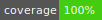

# Challenge: green thumb

A vanilla javascript challenge from [this figma design](https://www.figma.com/file/Socuz9DYBg9WklbQIWITWq/greenthumb-pocket-v2) and only development packages are allowed.

I made using Parcel + SASS + typescript + Jest + @testing-library/dom.

## Installation

1. Clone the repo

```terminal
git clone https://github.com/alexandrehpiva/green-thumb.git
```

2. Go to the folder

```terminal
cd green-thumb
```

3. Install NPM packages using yarn or npm install

```terminal
yarn
```

4. Start the project

```terminal
yarn start
```

## Other scripts

- Generate a production build of the project to ./build folder

```terminal
yarn build
```

- Check test coverage

```terminal
yarn coverage
```
